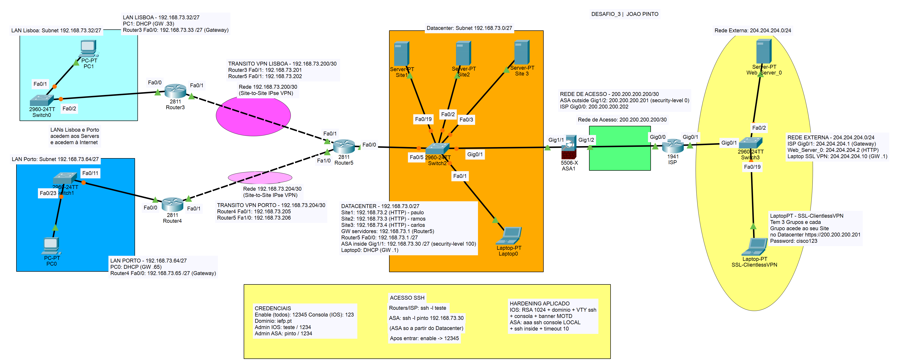

# Projeto de Segurança de Rede — Cisco Packet Tracer

Cenário **hub-and-spoke** que interliga duas delegações (Lisboa e Porto) e um Datacenter central, com acesso controlado à Internet. Implementa firewall de perímetro, acesso remoto seguro e cifra do tráfego entre locais. Trabalho desenvolvido no âmbito do curso de **Cibersegurança**.

## Topologia

O **Router5**, no Datacenter, é o nó central (*hub*) ao qual se ligam as duas LANs (*spokes*) por ligações de trânsito. Uma firewall **Cisco ASA** separa toda a rede interna do exterior, e um router **ISP** simula a rede externa/Internet.

## Plano de endereçamento

Todo o interior usa o bloco `192.168.73.0/24`, subnetado em `/27`.

| Sub-rede | Endereço | Função |
| --- | --- | --- |
| Datacenter | `192.168.73.0/27` | Servidores Site1/2/3, Router5, ASA (inside) |
| LAN Lisboa | `192.168.73.32/27` | PC1 (por DHCP), gateway Router3 |
| LAN Porto | `192.168.73.64/27` | PC0 (por DHCP), gateway Router4 |
| Trânsito VPN | `192.168.73.200/30` e `.204/30` | Ligações *spoke* ↔ *hub* |
| Rede de Acesso | `200.200.200.200/30` | ASA (outside) ↔ ISP |
| Rede Externa | `204.204.204.0/24` | ISP, servidor web externo, cliente VPN |

## Tecnologias implementadas

- **Encaminhamento** estático entre as duas LANs, o Datacenter e a Internet, com o Router5 como *hub*.
- **Switching** — quatro switches de camada 2 (VLAN 1), cada um com endereço de gestão (SVI) e administração por SSH.
- **DHCP** servido pelo router de cada LAN (PC0, PC1 e Laptop0), com os endereços fixos reservados.
- **Firewall Cisco ASA 5506-X** — zonas *inside/outside* com níveis de segurança, ACLs de saída e inspeção de ICMP.
- **SSL Clientless VPN** na ASA, com três grupos de utilizadores, em que cada grupo acede apenas ao seu servidor web.
- **VPN IPsec site-to-site** — dois túneis (Lisboa e Porto) com cifra AES-256/SHA, Router5 como *hub*.
- **Hardening de gestão** em todos os equipamentos — SSH, palavras-passe, utilizador local e *banner* de aviso.

## Conteúdo do repositório

| Ficheiro | Descrição |
| --- | --- |
| `rede.pkt` | Projeto do Cisco Packet Tracer |
| `Relatorio_PacketTracer.docx` | Relatório técnico passo a passo (replicação integral) |
| `Resumo_PacketTracer.docx` | Relatório-resumo do projeto |
| `topologia.png` | Diagrama da topologia |
| `README.md` | Este ficheiro |

## Como abrir

1. Abrir o ficheiro `rede.pkt` no Cisco Packet Tracer.
2. Para reproduzir do zero, seguir as fases do relatório técnico pela ordem apresentada (o encaminhamento básico deve funcionar antes de se aplicar o IPsec).

## Segurança e credenciais

As credenciais utilizadas são de **laboratório** e estão documentadas no **Anexo A** do relatório técnico. Não são incluídas aqui para não as expor no repositório.

Destaques de segurança do cenário:

- Segmentação por sub-redes `/27` e separação interior/exterior pela ASA.
- Acesso externo direto aos servidores internos bloqueado — só acessíveis pelo portal SSL VPN autenticado.
- Tráfego inter-site cifrado por IPsec.
- Gestão exclusivamente por SSH (sem Telnet em claro).

## Notas

Algumas particularidades do Packet Tracer encontradas durante o trabalho (criação de *bookmarks* da SSL VPN apenas pela GUI, ausência do comando `banner` na ASA, necessidade de permitir explicitamente o tráfego de retorno, entre outras) estão reunidas no **Anexo B** do relatório técnico.
